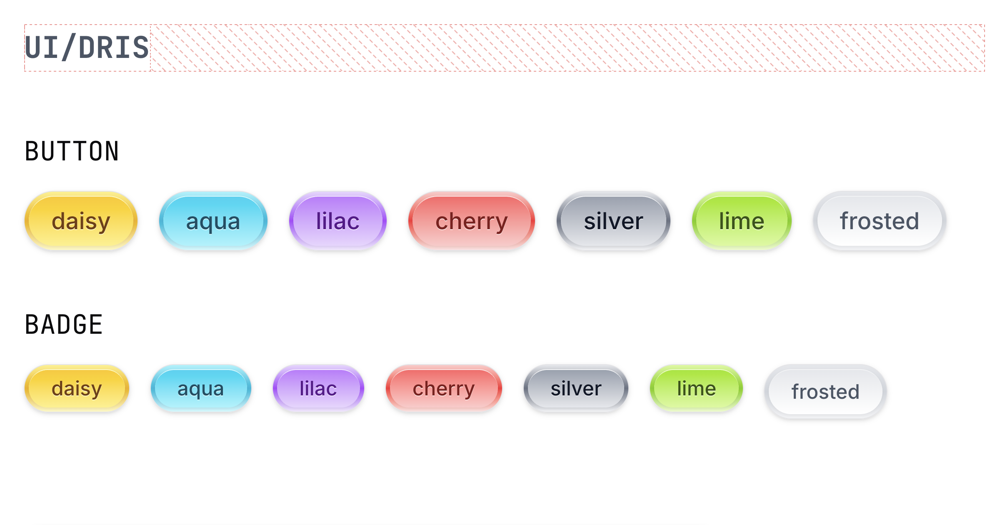

# UI



A 2000s-style component library refreshed for the 21st century.

## Getting Started

Clone the repository:

```bash
git clone https://github.com/DRIS-LLC/ui.git
```

Install dependencies:

```bash
pnpm install
```

Then, run the development server:

```bash
pnpm run dev
```

Open [http://localhost:3000](http://localhost:3000) in your browser to see the page.
